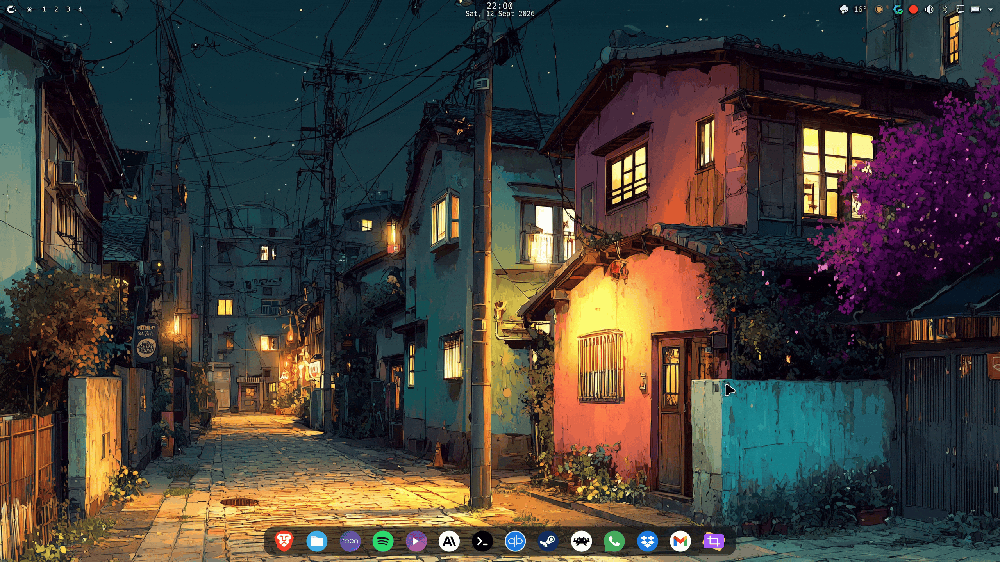
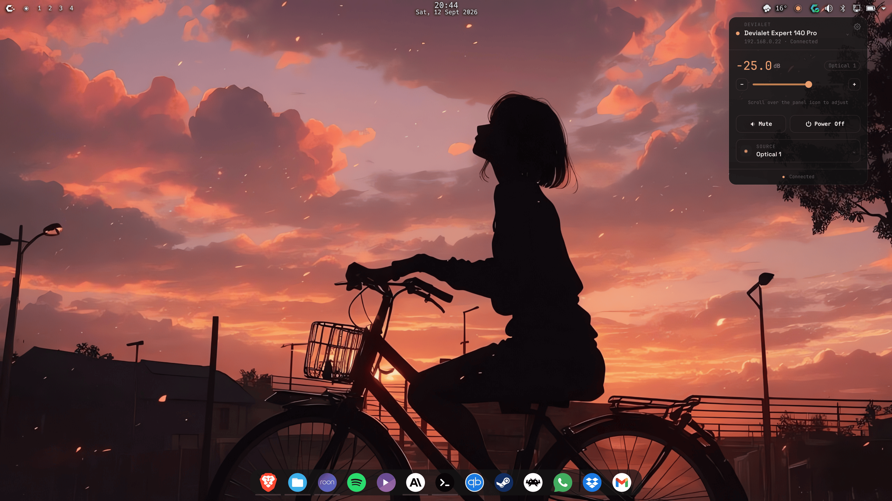
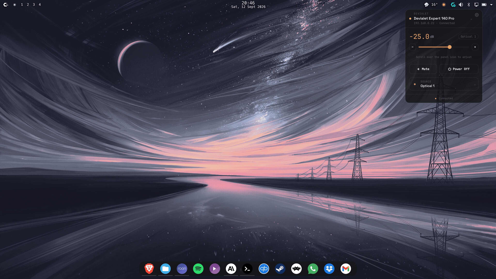
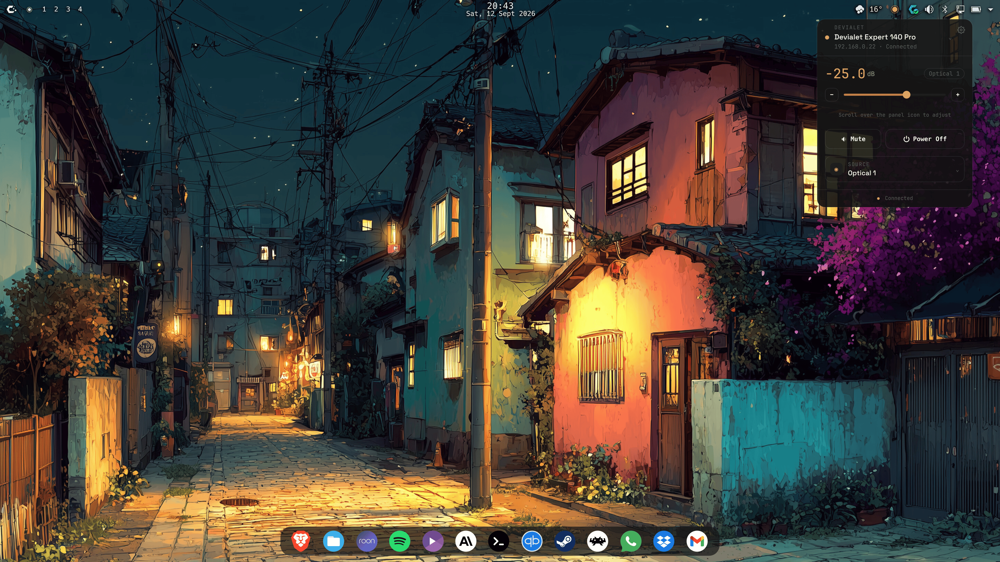
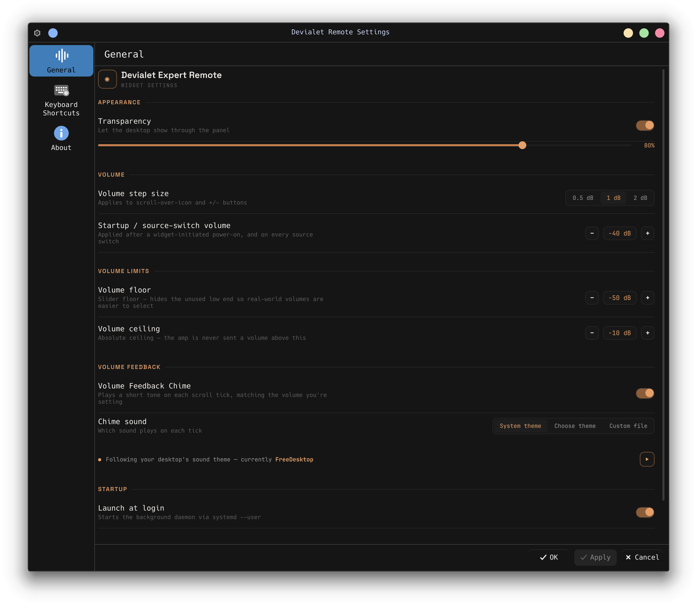
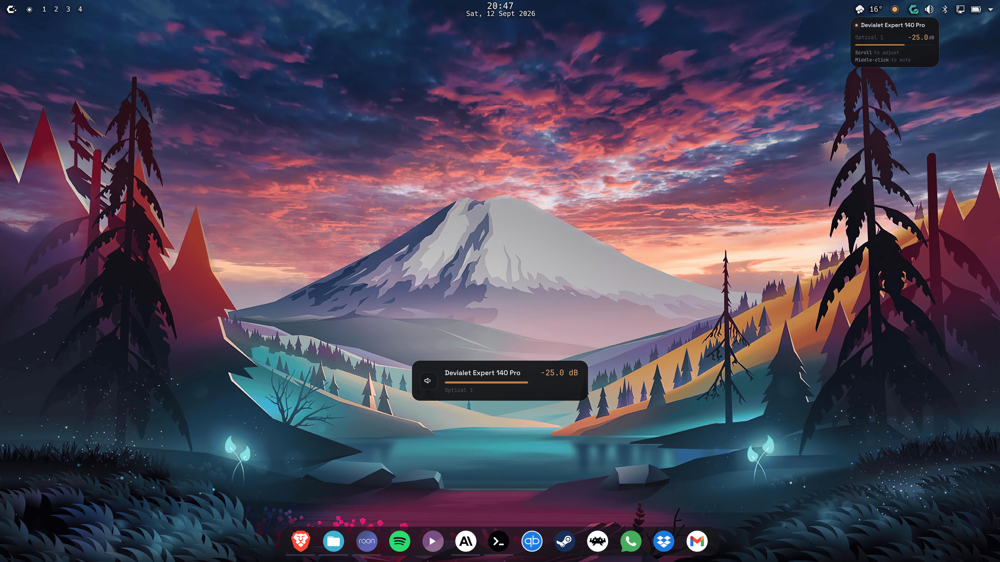
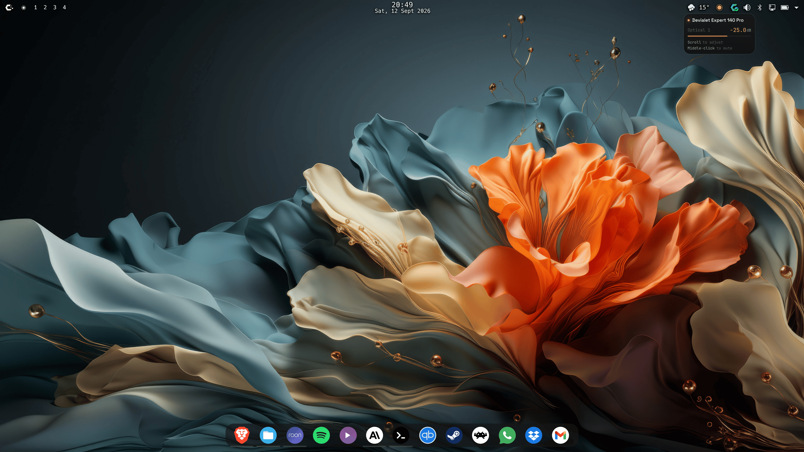

*Scroll over the panel icon to adjust volume — the on-screen display and the flyout follow the amplifier in real time.*

# Devialet Expert Remote — KDE Plasma 6 widget

Control your Devialet Expert Pro amplifier from your Plasma panel — volume, source, power, all live over UDP.


## Features

- **Live volume and mute** — scroll over the panel icon, middle-click it to mute, or use the flyout slider; the amplifier's own status broadcasts drive what you see, so the widget always shows the real level, including changes made from the remote or the front panel.
- **Source switching** — pick any of the amplifier's inputs from the flyout; the configured startup volume is applied after every switch and after a widget-initiated power-on.
- **Power on and off** from the flyout, with the amplifier's real state reflected as it boots.
- **Volume feedback chime** — an optional short tone on every scroll tick, taken from your desktop's sound theme, a theme of your choice, or a custom file.
- **Panel tooltip and volume OSD** — hover the icon for the current amp, source and level; adjustments show a brief on-screen confirmation.
- **Configurable limits** — a slider floor, an absolute volume ceiling the amplifier is never sent past, a scroll step of 0.5, 1 or 2 dB, and a startup volume.
- **Adjustable transparency** for the flyout, tooltip and OSD.
- **Multi-amp aware** — every Expert Pro broadcasting on your network is discovered automatically; pick the one to control from the flyout header.
- **Launch at login** — the background daemon runs as a `systemd --user` service, toggled straight from the settings page.

## Screenshots

The widget is a normal panel applet: drag it onto any panel via **Add Widgets**, click it for the flyout, hover it for the tooltip, scroll it for volume.

### The flyout



*The flyout, top to bottom: the amplifier header (name, IP, connection state — click it to pick a different amplifier), the current level with the slider and ± step buttons, Mute and Power, and the active source (click to switch inputs).*



*The panel is translucent, at the opacity you choose in Settings, so it sits on any wallpaper.*



*Every value shown comes from the amplifier's own status broadcasts, so the flyout stays right even when the volume is changed from the physical remote.*

### Settings

<p align="center">
  
</p>

*Every setting lives on one page: scroll step, startup and limit volumes, chime sound, transparency, and launch at login. Open it from the gear in the flyout.*

### Panel tooltip & volume OSD



*Hover the icon for live status; scroll to adjust and the OSD in the middle of the screen confirms the new level.*



*The hover tooltip: amplifier name, active source and current volume, plus the two shortcuts — scroll to adjust, middle-click to mute.*

## Requirements

| Component | Version / notes |
|---|---|
| KDE Plasma | 6.0 or later |
| systemd | user session (`systemctl --user`), for the background daemon |
| Rust toolchain | `cargo` — the installer builds the three binaries from source |
| `kpackagetool6`, `jq`, `sudo` | used by the installer; `kpackagetool6` ships with Plasma (package `kpackage` on Arch) |
| Devialet Expert Pro | on the same LAN as this machine; developed and tested on an Expert 140 Pro, protocol shared across the Expert / Expert Pro line |

## Install

Clone the repository and run the installer. It builds the binaries, installs them to `/usr/local/bin` (the only step that asks for `sudo`), installs and starts the daemon's `systemd --user` unit, and installs the plasmoid. It is safe to re-run after pulling changes — every step is idempotent, and it only restarts the daemon when the binary actually changed.

```
git clone https://github.com/ekmanch/devialet-expert-remote-kde.git
cd devialet-expert-remote-kde
./install.sh
```

Then add **Devialet Remote** to a panel via **Add Widgets**. If the widget was already on your panel before an upgrade, run `plasmashell --replace &` (or log out and back in) so Plasma loads the new version.

## Uninstall

`uninstall.sh` stops **and** disables the background daemon (`systemctl --user disable --now`) and deletes its unit file, removes the plasmoid and its picker icon, and deletes the three binaries from `/usr/local/bin` — so nothing keeps running after it's gone. It is safe to re-run; anything already removed is skipped.

```
./uninstall.sh
```

Two things are deliberately left in place, and named when the script finishes: the daemon's remembered amplifier selection in `~/.config/devialet-remote-daemon/`, and the widget's settings inside Plasma's own `appletsrc`. If the widget is still on a panel, remove it there (right-click → Remove).

## Try before installing

Design mockups for every UI surface live under [`design/mockups/`](design/mockups/) as standalone HTML files — the [flyout](design/mockups/flyout/), the [settings window](design/mockups/settings_window/), the [panel tooltip](design/mockups/tooltip/) and the [volume OSD](design/mockups/OSD/). Open any of them directly in a browser to click through the interactions before installing anything. They are the reference the widget is built to match.

## Architecture

Three small parts, Rust and QML only, no C++:

- **The plasmoid** (`plasmoid/`) — QML for the panel icon, flyout, tooltip, OSD and settings page.
- **`devialet-remote-daemon`** — a small Rust service, run by `systemd --user`, that listens for the amplifier's UDP status broadcasts and publishes the current state over D-Bus. The plasmoid reads that state via property change notifications, so nothing polls.
- **`devialet-ctl`** — a single-shot Rust command the plasmoid runs for each action (volume, mute, power, source), sending one UDP command packet to the amplifier. `devialet-chime` plays the volume feedback tone the same way.

Packet building and parsing live in a dependency-free protocol crate (`crates/protocol`), shared by the daemon and the CLI and covered by byte-exact tests. The protocol itself is documented in [`docs/protocol.md`](docs/protocol.md).

---

<sub>MIT License · Protocol reference: <a href="https://github.com/ekmanch/devialet-expert-remote">ekmanch/devialet-expert-remote</a> (the Android app this widget ports), which in turn builds on the community projects <a href="https://github.com/jprouty/devialet_expert">jprouty/devialet_expert</a> and <a href="https://github.com/gnulabis/devimote">gnulabis/devimote</a>. Not affiliated with Devialet.</sub>
